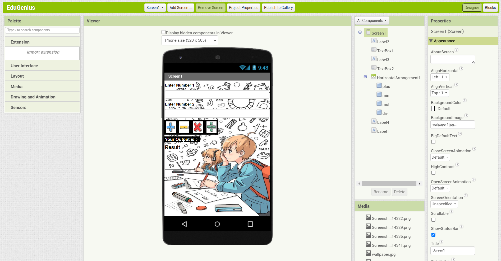
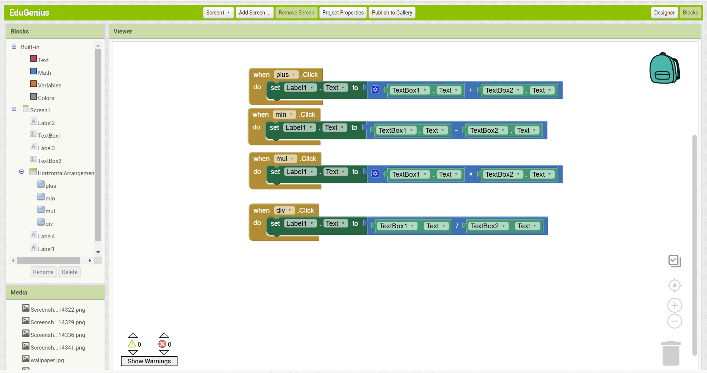

# EduGenius Calculator - MIT App Inventor Demo

## Overview
This is a simple calculator application built using **MIT App Inventor** as a demonstration for **EduGenius**. The app features a basic user interface created with a drag-and-drop approach and logic implemented using block-based programming.

## Features
- **User-friendly UI**: Built using MIT App Inventor’s drag-and-drop components.
- **Basic arithmetic operations**: The app includes buttons to perform addition, subtraction, multiplication, and division.
- **Background Image**: A visually appealing background is applied to enhance the UI.

## How It Works
1. The user enters two numbers in the input fields.
2. Pressing an operation button (+, -, ×, ÷) processes the inputs and displays the result.
3. The logic for calculations is implemented using MIT App Inventor’s block editor.

## Setup Instructions
1. Open **MIT App Inventor** ([https://appinventor.mit.edu/](https://appinventor.mit.edu/)).
2. Import the provided project file (.aia) into MIT App Inventor.
3. Customize the UI as needed using the Designer tab.
4. Modify the calculator logic in the Blocks tab.
5. Test the app using **AI Companion** or export it as an APK.

## Screenshots
The following screenshots showcase the app's design and logic:

### UI Design

### Block Logic

## Presentation
For a detailed walkthrough, refer to the presentation linked below:
[Click here to view the presentation](#) *(Replace with actual link)*

## Technologies Used
- **MIT App Inventor**
- **Block-based programming**
- **Android App Development** (for testing and deployment)

## Author
Aditya Devarshi

---
